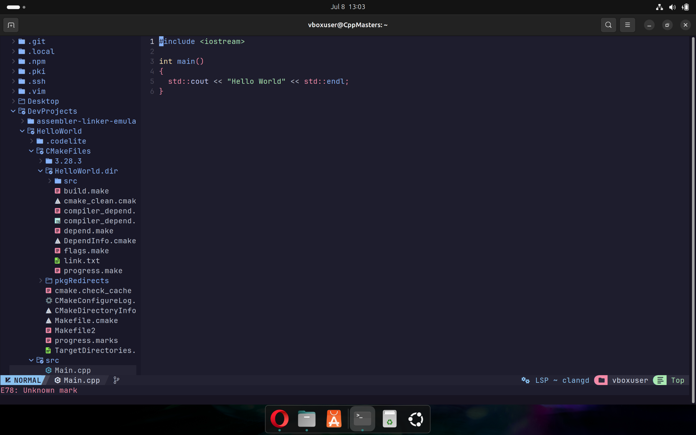

# Neovim Custom Configuration

## Introduction to Neovim

Neovim is a modern, extensible, and highly customizable text editor that builds upon the legacy of Vim. It’s designed for developers who wants a fun editing experience. Neovim allows you to tailor your workflow to your exact preferences, making it a favorite among programmers. Neovim’s plugin support will let you craft an editor that feels uniquely yours.

## Why Use Neovim? Just try it.
- **Performance**: It's fast, yes.
- **Customizability**: A lot of plugins, so yes. 
- **Fun and Engaging**: A LOT!
- **Community-Driven**: Constant updates, therefore it's true.

Neovim supports configuration in two formats: `.vim` (Vimscript) and `.lua`. While both are powerful, I recommend using `.lua` for its modern syntax and better performance.

## Setup Process

Easy steps to set up a custom Neovim configuration with NvChad, a pre-configured setup that enhances Neovim with a beautiful UI and essential plugins.


Ensure you’re running the latest version of Neovim. Check your current version with:

```bash
nvim --version


### 🧹 1. Clean Up Old Neovim Installation

If it’s not the latest version, remove any old Neovim files to prevent conflicts:

```bash
rm -rf ~/.config/nvim
rm -rf ~/.local/share/nvim
rm -rf ~/.cache/nvim
sudo rm -f /usr/local/bin/nvim
sudo rm -rf /opt/nvim


### 🧰 2. Install Dependencies

Install essential tools for building and plugin support:

```bash
sudo apt update
sudo apt install gcc make curl git
sudo apt install ripgrep #optional


### 🔤 3. Install a Nerd Font

JetBrainsMono is used in this guide, but you can choose others like **Fira**, **Cascadia**, etc.

```bash
git clone --depth 1 https://github.com/ryanoasis/nerd-fonts.git
cd nerd-fonts
./install.sh JetBrainsMono
cd ..
rm -rf nerd-fonts


### 📦 4. Install Neovim (Latest)

Download and install the latest Neovim release:

```bash
curl -LO https://github.com/neovim/neovim/releases/latest/download/nvim-linux64.tar.gz
tar -xzf nvim-linux64.tar.gz
sudo mv nvim-linux64 /opt/nvim
sudo ln -sf /opt/nvim/bin/nvim /usr/local/bin/nvim
rm nvim-linux64.tar.gz


### 🌟 5. Install NvChad

Clone the NvChad starter configuration and open Neovim:

```bash
git clone https://github.com/NvChad/starter ~/.config/nvim && nvim


### 6. Install Plugins and Dependencies

After opening Neovim, Lazy (NvChad’s plugin manager) will automatically install plugins. To install language servers and other tools, run:

```vim
:MasonInstallAll

This installs dependencies like clangd, clang-format, and codelldb for enhanced coding support.


### 7. Essential Keymaps

Here are some key shortcuts to get started with NvChad:

- `:Lazy` – Open the Lazy panel to manage plugins (install, update, sync, etc.)  
- `<Space>` – Leader key (be cautious if you change it)  
- `<Ctrl> + n` – Toggle NvimTree (file explorer on the left)  
- `<Shift>` – Open the status bar to view additional shortcuts and keymaps  
- `<Tab>` – Switch between open files  
- `<Ctrl> + h` – Return to NvimTree from an open file  
- `<Space>th` – Change the theme


## Getting Started

- Open Neovim by typing `nvim` in your terminal.  
- Let Lazy install plugins automatically on first launch.  
- Run `:MasonInstallAll` to set up language servers.  
- Explore the configuration files in `~/.config/nvim` to customize further.  
- Enjoy coding with your personalized, fun, and powerful Neovim setup!


## 🖼️ Neovim Preview

Here is how my Neovim setup looks:




